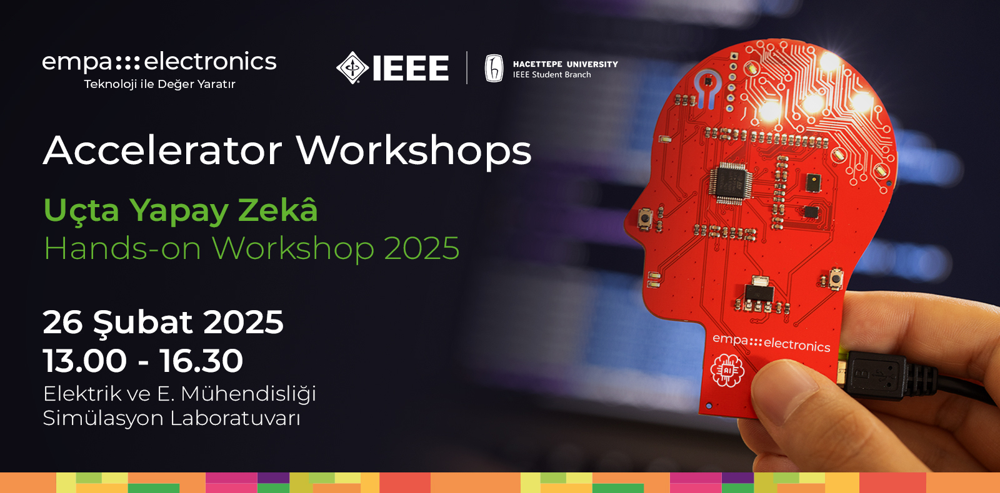
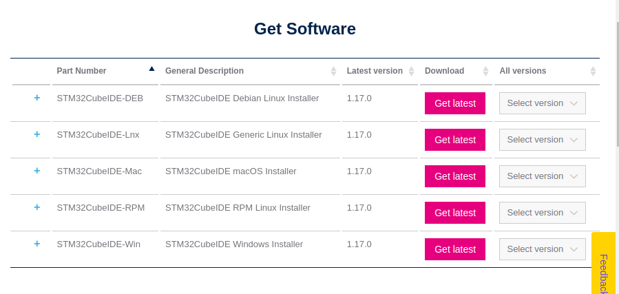
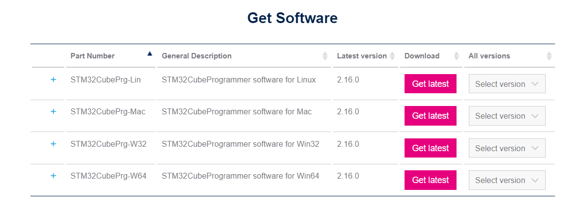
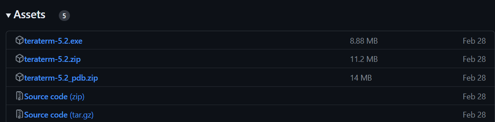

    

# Etkinlik Öncesi Yapılacaklar & Kurulumlar
Bu dokümantasyonda etkinlik öncesi gerekli programların ve paketlerin kurulumları anlatılacaktır. Kurulumu gerekli program ve paketler şu şekildedir:

1. [STM32CubeIDE](https://www.st.com/en/development-tools/stm32cubeide.html)
3. [STM32CubeProgrammer](https://www.st.com/en/development-tools/stm32cubeprog.html)
4. [TeraTerm](https://github.com/TeraTermProject/teraterm/releases)

## 1- STM32CubeIDE Kurulumu

STM32CubeIDE, STM32 mikrodenetleyicileri ve mikroişlemcileri için gerekli çevresel yapılandırmaların yapılmasını, kod oluşturma ve derlemeyi, kodun hata ayıklama işlemlerini ve cihaza yüklenmesini sağlayan Eclipse tabanlı bir C/C++ geliştirme platformudur.

Öncelikle STMicroelectronics’nin sitesinden STM32CubeIDE 1.17.0 (en son sürüm) versiyonunu indiriniz.
Aşağıdaki seçenekler arasından işletim sisteminize uygun olanı indirip kurulumunu gerçekleştirin.
 

  

 

NOT 1: Kurulum yapacağınız hedef klasör yolunda Türkçe karakter ve boşluk olmadığına dikkat ediniz.

NOT 2: Kurulum sırasında ST-LINK ve SEGGER J-Link sürücülerinin yüklenip yüklenmeyeceği sorulacaktır. Bu sürücüleri seçip yükleme işlemlerine devam ediniz.

## 2- STM32CubeProgrammer Kurulumu

STM32CubeProgrammer, STM32 mikrodenetleyicileri programlama ve konfigürasyonlarını ayarlamak için tasarlanmış grafiksel bir araçtır.
 Öncelikle STMicroelectronics’in [sitesinden](https://www.st.com/en/development-tools/stm32cubeprog.html) **STM32CubePrg 2.18.0** (en son sürümü indiriniz) versiyonunu indiriniz.

 

  

 

## 3- Tera Term Kurulumu
Tera Term, kullanıcıların seri port iletişimi sağlayarak uzak bilgisayarlara erişmelerine ve UART gibi çeşitli iletişim protokolleri aracılığıyla cihazlarla iletişim kurmalarına olanak tanır. Bilgisayar ile geliştirme kartı arasında UART üzerinden iletişim sağlamak için bu program kullanılacaktır.
Github [sayfasından](https://github.com/TeraTermProject/teraterm/releases) Assets altından dosyasını indiriniz ve kurulumu gerçekleştiriniz. 

  

 

Gerekli kurulumlar tamamlanmıştır.